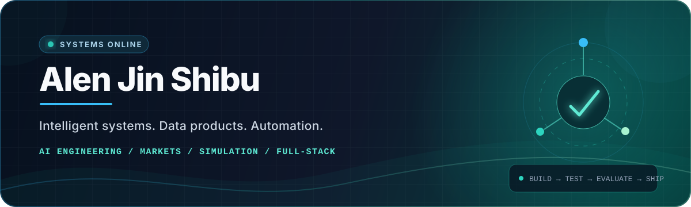

<!--
  GitHub profile README for github.com/mgi25
  Built to stay useful even when third-party stats services are unavailable.
-->

<div align="center">
  
</div>

<div align="center">
  <a href="mailto:alenjinmgi@gmail.com"></a>
  <a href="https://www.linkedin.com/in/alen-jin-shibu/"></a>
  <a href="https://github.com/mgi25?tab=repositories"></a>
</div>

<br />

## `> whoami`

I'm a **data scientist and full-stack developer** who enjoys turning uncertain, real-world problems into systems that can be measured, tested, and operated.

My work sits at the intersection of **AI engineering, market systems, simulation, analytics, and product development**. I care as much about guardrails, reproducibility, and observability as I do about the model or feature itself.

```text
CURRENT SIGNAL
├─ Building      Simulation Factory — repeatable AI-directed engineering workflows
├─ Exploring     Agentic systems, market intelligence, and decision automation
├─ Shipping      Python services, data products, dashboards, and full-stack tools
└─ Optimizing    Reliability, evaluation, safety boundaries, and clean architecture
```

## Featured work

<table>
  <tr>
    <td width="50%" valign="top">
      <h3><a href="https://github.com/mgi25/Simulation-Factory">Simulation Factory</a></h3>
      <p>An AI-directed engineering and production system for developing, testing, and evaluating simulation experiences—from procedural race systems to repeatable company workflows.</p>
      <p><code>Python</code> <code>Godot</code> <code>pytest</code> <code>automation</code></p>
      <a href="https://github.com/mgi25/Simulation-Factory"><b>View flagship project →</b></a>
    </td>
    <td width="50%" valign="top">
      <h3><a href="https://github.com/mgi25/Autonomous_Upstox">Autonomous Upstox</a></h3>
      <p>A safety-bounded market-research and sandbox-execution agent with deterministic risk controls, audit trails, replay, and human-controlled authority boundaries.</p>
      <p><code>Python</code> <code>market data</code> <code>agentic AI</code> <code>risk systems</code></p>
      <a href="https://github.com/mgi25/Autonomous_Upstox"><b>Explore the architecture →</b></a>
    </td>
  </tr>
  <tr>
    <td width="50%" valign="top">
      <h3><a href="https://github.com/mgi25/news_market_game_updated">News Market Game</a></h3>
      <p>A live, seeded 90-minute market simulation with dedicated player, presenter, and admin experiences. Headlines move the market; interpretation is the game.</p>
      <p><code>Python</code> <code>Flask</code> <code>simulation</code> <code>real-time UX</code></p>
      <a href="https://github.com/mgi25/news_market_game_updated"><b>See how it works →</b></a>
    </td>
    <td width="50%" valign="top">
      <h3><a href="https://github.com/mgi25/xauusd_sma_mc_dashboard">XAUUSD Robustness Lab</a></h3>
      <p>A Streamlit research dashboard that backtests an SMA strategy and uses Monte Carlo resampling to test whether apparent performance is robust or accidental.</p>
      <p><code>Python</code> <code>Streamlit</code> <code>backtesting</code> <code>Monte Carlo</code></p>
      <a href="https://github.com/mgi25/xauusd_sma_mc_dashboard"><b>Open the dashboard project →</b></a>
    </td>
  </tr>
</table>

## Engineering approach

| 01 — Model the system | 02 — Build the boundary | 03 — Prove the behavior | 04 — Make it operable |
|:--|:--|:--|:--|
| Turn the problem into explicit states, contracts, and measurable outcomes. | Keep authority, data, execution, and failure domains deliberately separated. | Use deterministic tests, replay, evaluation evidence, and real-world validation. | Add observability, documentation, safe defaults, and practical operator workflows. |

## Toolbox

<div align="center">

  <p><strong>Languages &amp; data</strong></p>
  
  
  
  
  
  
  

  <p><strong>Applications &amp; APIs</strong></p>
  
  
  
  
  
  
  

  <p><strong>Engineering &amp; delivery</strong></p>
  
  
  
  
  
  

</div>

## Contribution stream

<div align="center">
  
  <br />
  <sub>Generated daily from my GitHub contribution history.</sub>
</div>

## Let's build something useful

I'm interested in thoughtful collaborations around **AI systems, simulation, fintech research, developer tooling, analytics, and automation**—especially projects where correctness and real-world usability matter.

<div align="center">
  <a href="mailto:alenjinmgi@gmail.com"></a>
  <a href="https://www.linkedin.com/in/alen-jin-shibu/"></a>
</div>

<br />

<div align="center">
  <sub>Designing systems that are intelligent, testable, and safe to operate.</sub>
</div>
